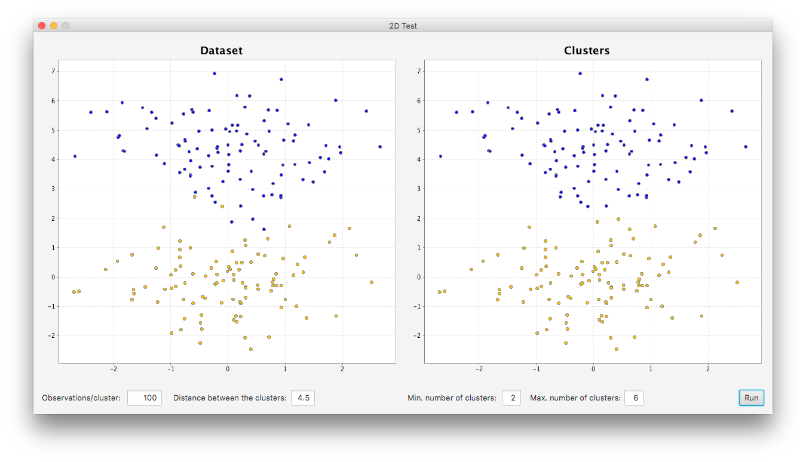

# ssc-1dtestcluster

An example of what to do with [stsc](https://github.com/ArmandGrillet/stsc).

GUI made to see the results when clustering a dataset in two dimensions. Accepts as parameters the number of observations per clusters, the distance between them and the minimum and maximum k used as inputs when clustering the dataset using STSC. The graph on the left is the representation of the two clusters created with a different color to see which observation is on which cluster. The graph on the right is the result of the clustering algorithm.

Copyright © 2016 Armand Grillet. All rights reserved.
